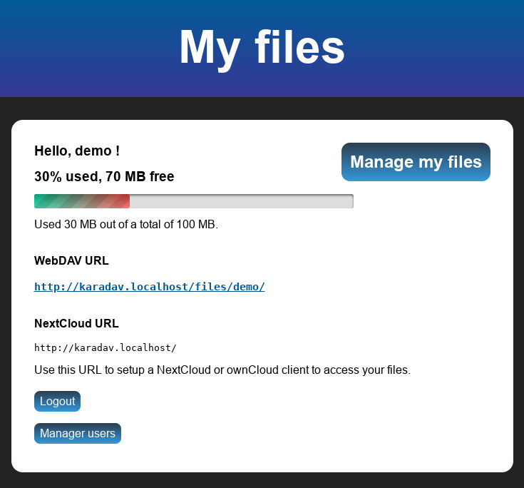
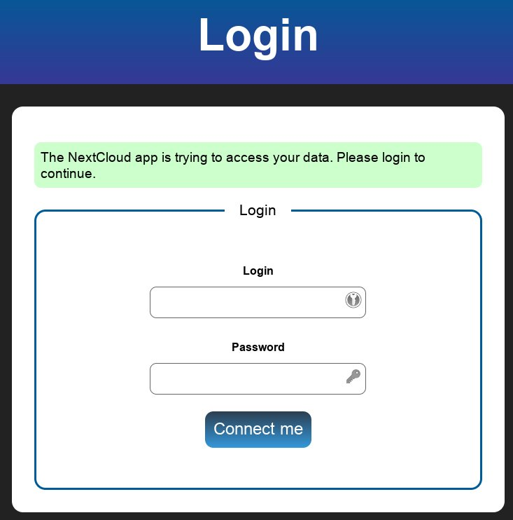

# KaraDAV - A lightweight WebDAV server, compatible with ownCloud and NextCloud clients

This is a simple and lightweight WebDAV server, allowing to easily set up a file sharing server compatible with WebDAV and NextCloud clients. It has no dependencies and good performance.

It is written in PHP (8+). The only dependency is SQLite3 for the database.

Its original purpose was to serve as a demo and test for the KD2 WebDAV library, which we developed for [Paheko](https://paheko.cloud/), our non-profit management solution, but it can also be used as a simple but powerful file sharing server.



If you are looking for an even lighter WebDAV server, try also our other server, [PicoDAV](https://fossil.kd2.org/picodav/). It isn't compatible with NextCloud/ownCloud clients, but it is a single file that you can drop anywhere in your document root, nothing to install!

* Fossil development repository: <https://fossil.kd2.org/karadav/>
* Git mirror: <https://github.com/kd2org/karadav/> (PR and issues accepted)

## Features

* User-friendly directory listings for file browsing with a web browser, using our [WebDAV Manager.js](https://fossil.kd2.org/webdav-manager/) client
	* Upload directly from browser, using paste or drag and drop
	* Rename
	* Delete
	* Create and edit text files
	* Create directories
	* MarkDown live preview
	* Preview of images, text, MarkDown and PDF
	* Editing of Office files using Collabora or OnlyOffice
	* Download all files from a directory
* WebDAV class 1, 2, 3 support, support for Etags
* No database server is required (SQLite3 is used)
* Multiple user accounts
* Support for per-user quota
* Share files using WebDAV: delete, create, update, mkdir, get, list
* Compatible with WebDAV clients
* Support for HTTP ranges (partial download of files)
* Support for [RFC 3230](https://greenbytes.de/tech/webdav/rfc3230.xhtml) to get the MD5 digest hash of a file (to check integrity) on `HEAD` requests (only MD5 is supported so far)
* Support for setting the file modification time using `PROPPATCH` and `Win32LastModifiedTime` or `{DAV:}lastmodified` properties
* Support for `Content-MD5` with `PUT` requests, see [dCache documentation for details](https://dcache.org/old/manuals/UserGuide-6.0/webdav.shtml#checksums)
* Support for some of the [Microsoft proprietary properties](https://greenbytes.de/tech/webdav/webdavfaq.html)
* Passes most of the [Litmus compliance tests](https://github.com/tolsen/litmus) (see below)
* Supports WOPI, for editing and viewing of documents using OnlyOffice, Collabora Online or MS Office.
* Support for LDAP
* Trashbin: files are moved to a `.trash` folder before being deleted completely
* Good performance!

### NextCloud/ownCloud features

KaraDAV is compatible with ownCloud and NextCloud clients, because on Android there is not much nice WebDAV clients, and on desktop their clients allow for two-way sync, which no other WebDAV client provides.

The following ownCloud/NextCloud specific features are supported:

* [Direct download](https://docs.nextcloud.com/server/latest/developer_manual/client_apis/OCS/ocs-api-overview.html#direct-download)
* [Chunk upload](https://docs.nextcloud.com/server/latest/developer_manual/client_apis/WebDAV/chunking.html)
* [Trashbin](https://docs.nextcloud.com/server/latest/developer_manual/client_apis/WebDAV/trashbin.html)
* `X-OC-MTime` [header](https://gitlab.gnome.org/GNOME/gvfs/-/issues/637) to set file modification time (also supported by [rclone](https://rclone.org/webdav/#provider-notes))
* `OC-Checksum` [header](https://github.com/owncloud-archive/documentation/issues/2964) to verify file upload integrity
* Login via app-specific passwords (necessary for NextCloud desktop and Android clients)
* Thumbnail/preview of images and files
* Workspace notes (`README.md` displayed on top of directory listing on Android app) and workspace notes editing

## Screenshots

### Files management using the Web UI


### Login from NextCloud client



## NextCloud/ownCloud compatibility

This server should be compatible with ownCloud and NextCloud synchronization clients (desktop, mobile, CLI).

It has been successfully tested with:

* [ownCloud Desktop](https://nextcloud.com/install/) (tested on Debian Linux)
* [NextCloud Desktop](https://owncloud.com/desktop-app/) (tested on Debian Linux)
* NextCloud Android app ([F-Droid](https://f-droid.org/en/packages/com.nextcloud.client/))
* ownCloud Android app ([F-Droid](https://f-droid.org/en/packages/com.owncloud.android/))
* [NextCloud CLI client](https://docs.nextcloud.com/desktop/3.5/advancedusage.html) (Debian Linux) *-- Note: make sure to pass options before parameters.*
* [ownCloud CLI client](https://doc.owncloud.com/desktop/next/advanced_usage/command_line_client.html) (Debian Linux)

**We recommend the ownCloud apps**, as they are more stable and lighter :)

Note that even though it has been tested with NC/OC clients, KaraDAV might stop working at any time with these clients if their publishers decide so.

## WebDAV clients compatibility

### Recommended (tested with KaraDAV)

* Linux:
  * KDE-based file browsers: Dolphin, Konqueror, Krusader…
  * GTK-based file browsers (Thunar, Nautilus, Caja, PCManFM, etc.): they will work, but the GTK implementation is usually slower than KDE
  * [FUSE webdavfs](https://github.com/miquels/webdavfs)
* MacOS:
  * [Cyberduck](https://cyberduck.io/) or [Mountain Duck](https://mountainduck.io/) (proprietary)
* Windows:
  * [Cyberduck](https://cyberduck.io/) or [Mountain Duck](https://mountainduck.io/) (proprietary)
  * [WinSCP](https://winscp.net/)
* Android:
  * [DAVx⁵](https://www.davx5.com/) (libre), see [the manual](https://manual.davx5.com/webdav_mounts.html) for how to set up a WebDAV mount
  * [RCX](https://f-droid.org/en/packages/io.github.x0b.rcx/) or its fork [Round-Sync](https://github.com/newhinton/Round-Sync)

### Others

* [rclone](https://rclone.org/webdav/) works, including [bi-directional sync](https://rclone.org/bisync/)! Pick `NextCloud` as the WebDAV vendor to enable advanced sync features.
* Linux:
  * davfs2 is **NOT** recommended: it is very slow, and it is using a local cache, meaning changing a file locally may not be synced to the server for a few minutes, leading to things getting out of sync. If you have to use it, at least disable locks, by setting `use_locks=0` in the config. Other recommended options are `gui_optimize=1` and `delay_upload=0`. See manpage for details.
  * [csync](https://csync.org/) on Linux (works). This is a library offering two-way sync, it is used by the ownCloud client, but it has a command-line client. Just replace `http` with `owncloud`, and `https` with `ownclouds` in URL, eg. `csync /home/username/sync ownclouds://karadav.example/files/username/`
  * [cadaver](https://notroj.github.io/cadaver/) command-line client for WebDAV (untested)
  * [Celeste](https://github.com/hwittenborn/celeste) is a Rclone GUI to sync your directories (untested)
  * [Filestash](https://github.com/mickael-kerjean/filestash) is a web client (untested)
* Windows:
  * the native webclient (also called 'MiniRedir') **is notoriously bad**. We tested it successfully on Windows 10, but it seems to now [be deprecated and scheduled to be removed](https://help.nextcloud.com/t/end-of-microsoft-support-for-its-webclient-service-on-windows-10-and-11/174121) in Windows 11.
  * [CarotDAV](http://rei.to/carotdav_en.html) (proprietary, untested)
* Android:
  * [EasySync](https://github.com/phpbg/easysync) (does not allow to sync user-chosen folders sadly)
  * [WebDAV provider](https://github.com/alexbakker/webdav-provider) (untested)
  * [WebDAV Sync](https://github.com/SakiiCode/WebDavSync) (untested)
  * [X-Plore](https://www.lonelycatgames.com/apps/xplore) (proprietary) has been tested and works, but the app is now full of intrusive video ads, don't use it!
  * [DrivinCloudOpen](https://github.com/bohwaz/drivinCloudOpen) is a defunct open-source Android WebDAV client that was easy to use
* iOS:
  * [WebDAV Nav+](https://apps.apple.com/app/webdav-nav/id412341302) (proprietary, untested)
  * [WebDAV Navigator](https://apps.apple.com/app/webdav-navigator/id382551345) (proprietary, untested)

## WOPI (office document editing) compatibility

KaraDAV has been tested successfully with:

* Collabora Development Edition (see [COLLABORA.md](doc/COLLABORA.md))
* OnlyOffice Community Edition

## Future development

This might get supported in future (maybe):

* Probably: [NextCloud sharing](https://docs.nextcloud.com/server/latest/developer_manual/client_apis/OCS/ocs-share-api.html)
* Maybe: NextCloud files versioning
	* [NextCloud API](https://docs.nextcloud.com/server/latest/developer_manual/client_apis/WebDAV/versions.html)
	* [NextCloud versioning pattern](https://docs.nextcloud.com/server/latest/user_manual/en/files/version_control.html)
	* [NextCloud implementation](https://github.com/nextcloud/server/blob/master/apps/files_versions/lib/Storage.php))
	* [Mercurial revlog](https://www.mercurial-scm.org/wiki/Revlog)
	* [Eric Sink on SCM versioning](https://ericsink.com/scm/scm_repositories.html)

This probably won't get supported anytime soon:

* CalDAV/CardDAV support:
  * this would require a [bunch of new stuff implemented](https://evertpot.com/227/)
  * the only CalDAV test suite ([CavDAVtester](https://github.com/apple/ccs-caldavtester)) does not work anymore as it's written for Python 2
  * for now the best option is to use [Baikal from Sabre/DAV](https://sabre.io/baikal/) for that
  * Nice web clients to add to Baikal are [AgenDAV](https://github.com/agendav/agendav) and [InfCloud](https://inf-it.com/open-source/clients/infcloud/)
* [Extended MKCOL](https://www.rfc-editor.org/rfc/rfc5689) required only if CalDAV support is implemented
* [Partial upload via PATCH](https://github.com/miquels/webdav-handler-rs/blob/master/doc/SABREDAV-partialupdate.md)
* [Resumable upload via TUS](https://tus.io/protocols/resumable-upload.html)
* [WebDAV sharing if it ever becomes a spec?](https://evertpot.com/webdav-caldav-carddav-sharing/)

## Install instructions

See [specific install documentation](doc/INSTALL.md).

## Dependencies

This depends on the KD2\WebDAV and KD2\WebDAV_NextCloud classes from the [KD2FW package](https://fossil.kd2.org/kd2fw/), which are packaged in this repository.

They are lightweight and easy to use in your own software to add support for WebDAV and NextCloud clients to your software. Contact us for a commercial license.

## Similar software alternatives

* [Davros](https://github.com/mnutt/davros/) used to be compatible with NextCloud client [before version 2.5.0](https://github.com/owncloud/client/issues/6775)
* [FileRun](https://filerun.com) is a proprietary solution compatible with the NextCloud Android app

These don't support NextCloud or ownCloud clients:

* Apache mod_dav is fast and easy to set up.
* [SFTPGo](https://sftpgo.com/)
* [Pydio Cells](https://pydio.com/)
* [Seafile](https://manual.seafile.com/12.0/extension/webdav/)
* [BewCloud](https://github.com/bewcloud/bewcloud) ([doesn't support WebDAV currently](https://github.com/bewcloud/bewcloud/issues/32))

### Calendar and contacts

If you are looking for calendar (CalDAV) and contacts (CardDAV), KaraDAV doesn't have these, so have a look at these servers:

* [Davis](https://github.com/tchapi/davis) (PHP, Baikal fork)
* [Baikal](https://sabre.io/baikal/) (PHP)
* [Radicale](https://radicale.org/) (Python)
* [DAViCal](https://www.davical.org/) (PHP, calendar only)

And these clients:

* [AgenDAV](https://github.com/agendav/agendav) (web, PHP, calendar only)
* [InfCloud](https://inf-it.com/open-source/clients/infcloud/) (web, javascript, calendar + contacts + todo lists)

## Performance

I created 300 small random files, totalling 5.5 MB:

```
for n in {1..300}; do
    dd if=/dev/urandom of=file$( printf %03d "$n" ).bin bs=1 count=$(( RANDOM + 1024 ))
done
```

Then I timed KaraDAV, mod_dav and NextCloud (24) (all installed on my laptop, with Apache 2.4) with various WebDAV clients doing those tasks:

* Copy 300 small files to the WebDAV share
* Refresh the directory (press F5)
* Delete all 300 selected files

KaraDAV performance was very close to mod_dav, and NextCloud performance was incredibly poor.

| Client | KaraDAV | NextCloud | mod_dav | bewCloud |
| --- | --- | --- | --- | --- |
| Dolphin (KDE) | 5 seconds | 1 minute 15 seconds | 3 seconds | [N/A](https://github.com/bewcloud/bewcloud/issues/32) |
| Thunar (GTK) | 5 seconds | 1 minute 50 seconds | 5 seconds | [N/A](https://github.com/bewcloud/bewcloud/issues/32) |
| WebDAV Manager.js | 4 seconds (no delete) | -- | -- | -- |

At the time of this test, WebDAV Manager.js didn't have the ability to select and delete multiple files at once, so the time shown is only for copy and refresh.

## Litmus compliance tests

Tests were performed using litmus source code as of December 13, 2017 from [the Github repo](https://github.com/tolsen/litmus).

We are not aiming at 100% pass, as we are mainly targeting file sharing, so we are not currently trying to fix rare `PROPPATCH` issues, but pull requests are welcome.

```
-> running `http':
 0. init.................. pass
 1. begin................. pass
 2. expect100............. pass
 3. finish................ pass
<- summary for `http': of 4 tests run: 4 passed, 0 failed. 100.0%

-> running `basic':
 0. init.................. pass
 1. begin................. pass
 2. options............... pass
 3. put_get............... pass
 4. put_get_utf8_segment.. pass
 5. mkcol_over_plain...... pass
 6. delete................ pass
 7. delete_null........... pass
 8. delete_fragment....... pass
 9. mkcol................. pass
10. mkcol_percent_encoded. pass
11. mkcol_again........... pass
12. delete_coll........... pass
13. mkcol_no_parent....... pass
14. mkcol_with_body....... pass
15. mkcol_forbidden....... pass
16. chk_ETag.............. pass
17. finish................ pass
<- summary for `basic': of 18 tests run: 18 passed, 0 failed. 100.0%

-> running `copymove':
 0. init.................. pass
 1. begin................. pass
 2. copy_init............. pass
 3. copy_simple........... pass
 4. copy_overwrite........ pass
 5. copy_nodestcoll....... pass
 6. copy_cleanup.......... pass
 7. copy_content_check.... pass
 8. copy_coll_depth....... pass
 9. copy_coll............. pass
10. depth_zero_copy....... pass
11. copy_med_on_coll...... pass
12. move.................. pass
13. move_coll............. pass
14. move_cleanup.......... pass
15. move_content_check.... pass
16. move_collection_check. pass
17. finish................ pass
<- summary for `copymove': of 18 tests run: 18 passed, 0 failed. 100.0%

```

With this litmus version, `props` and `locks` tests currently fail.

But they mostly pass with litmus 0.13-3 supplied by Debian:

```
-> running `props':
 0. init.................. pass
 1. begin................. pass
 2. propfind_invalid...... pass
 3. propfind_invalid2..... pass
 4. propfind_d0........... pass
 5. propinit.............. pass
 6. propset............... pass
 7. propget............... pass
 8. propextended.......... pass
 9. propmove.............. pass
10. propget............... pass
11. propdeletes........... pass
12. propget............... pass
13. propreplace........... pass
14. propget............... pass
15. propnullns............ pass
16. propget............... pass
17. prophighunicode....... pass
18. propget............... pass
19. propremoveset......... pass
20. propget............... pass
21. propsetremove......... pass
22. propget............... pass
23. propvalnspace......... pass
24. propwformed........... pass
25. propinit.............. pass
26. propmanyns............ pass
27. propget............... pass
28. propcleanup........... pass
29. finish................ pass
<- summary for `props': of 30 tests run: 30 passed, 0 failed. 100.0%

-> running `locks':
 0. init.................. pass
 1. begin................. pass
 2. options............... pass
 3. precond............... pass
 4. init_locks............ pass
 5. put................... pass
 6. lock_excl............. pass
 7. discover.............. pass
 8. refresh............... pass
 9. notowner_modify....... pass
10. notowner_lock......... pass
11. owner_modify.......... pass
12. notowner_modify....... pass
13. notowner_lock......... pass
14. copy.................. pass
15. cond_put.............. pass
16. fail_cond_put......... pass
17. cond_put_with_not..... pass
18. cond_put_corrupt_token WARNING: PUT failed with 400 not 423
    ...................... pass (with 1 warning)
19. complex_cond_put...... pass
20. fail_complex_cond_put. pass
21. unlock................ pass
22. fail_cond_put_unlocked pass
23. lock_shared........... pass
24. notowner_modify....... pass
25. notowner_lock......... FAIL (LOCK on locked resource)
26. owner_modify.......... pass
27. double_sharedlock..... FAIL (shared LOCK on locked resource:
423 Locked)
28. notowner_modify....... pass
29. notowner_lock......... pass
30. unlock................ pass
31. prep_collection....... pass
32. lock_collection....... pass
33. owner_modify.......... FAIL (PROPPATCH on locked resource on `/files/demo/litmus/lockcoll/lockme.txt': 423 Locked)
34. notowner_modify....... pass
35. refresh............... pass
36. indirect_refresh...... pass
37. unlock................ pass
38. unmapped_lock......... WARNING: LOCK on unmapped url returned 200 not 201 (RFC4918:S7.3)
    ...................... pass (with 1 warning)
39. unlock................ pass
40. finish................ pass
<- summary for `locks': of 41 tests run: 38 passed, 3 failed. 92.7%
-> 2 warnings were issued.
```

## Author

Paheko.cloud / BohwaZ. Contact me on: Mastodon = https://mamot.fr/@bohwaz

### Contributors

Thank you:

* Cédric Picard, for the security report

## License

This software and its dependencies are available in open source with the AGPL v3 license. This requires you to share all your source code if you include this in your software. This is voluntary.

For entities wishing to use this software or libraries in a project where you don't want to have to publish all your source code, we can also sell this software with a commercial license, contact me at bohwaz /at/ kd2 /dot/ org. We can do that as we have wrote and own 100% of the source code, dependencies included, there is no third-party code here.
